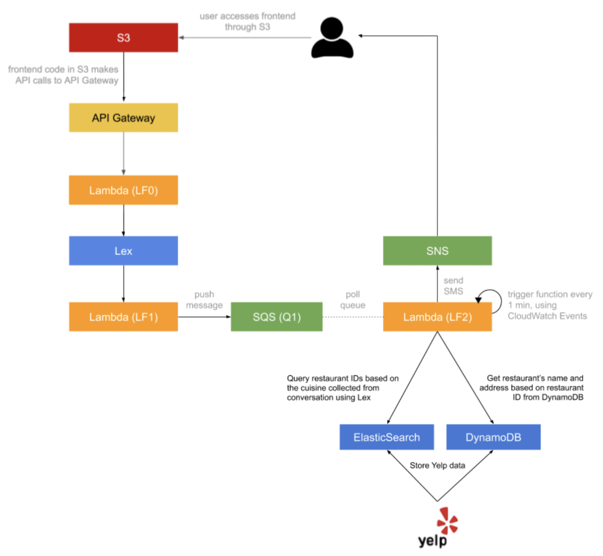

# Dining-Concierge-AI-ChatBot
A serverless chatbot with event-driven microservices using S3, Lambda, SQS, SNS, Lex, DynamoDB & ElasticSearch. A recommendation pipeline has been designed 
for automatically sending restaurant suggestions through texts based on user preferences. The application scrapes thousands of restaurants through Yelp API 
and enhanced recommendations based on current and previous customer chats

## Architecture


## Features of AI Bot
```
The following three intents:
1. GreetingIntent
2. ThankYouIntent
3. DiningSuggestionsIntent
The implementation of an intent entails its setup in Amazon Lex as well as handling its response in the Lambda function code hook.
```
  #### Greeting Intent
```
1. Created the intent in Lex
2. Trained and tested the intent in the Lex console,
3. Implemented the handler for the GreetingIntent in the Lambda code hook, such that when a request for the GreetingIntent is received, a response is composed 
   such as “Hi there, how can I help?”
```
#### Dining Suggestions Intent
```
1. The bot collects the following pieces of information from the user, through conversation:
    a. Location
    b. Cuisine
    c. Dining Time
    d. Number of people
    e. Phone number
 2. Based on the parameters collected from the user, the information is pushed to an SQS queue. 
 3. Users are notified over SMS once with the list of restaurant suggestions.
```

#### Integrate Lex chatbot to frontend chat API
```
1. AWS SDK is used to integrate Lex chatbot to frontend chat API from API lambda. 
2. Text message is extracted from the received API response.
3. This message is sent to Lex chatbot
4. Response sent back from Lex using API response.
```

#### Web Scrapping Restaurant Data using Yelp
```
1. AWS SDK was used to integrate the Lex chatbot to chat API to call Lex chatbot from the API Lambda. 
2. When an API request is received, the text message is extracted from the API request.
3. The same is sent to the Lex chatbot
4. Lex respondes as an API response with results.
```

